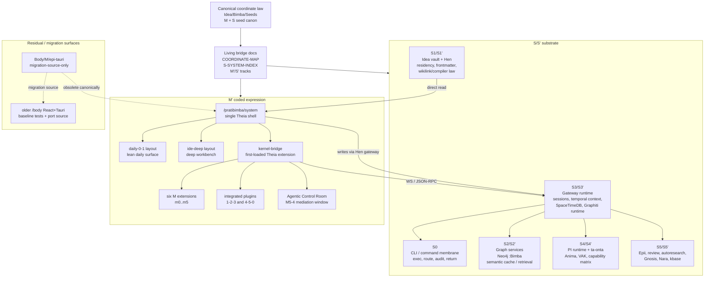
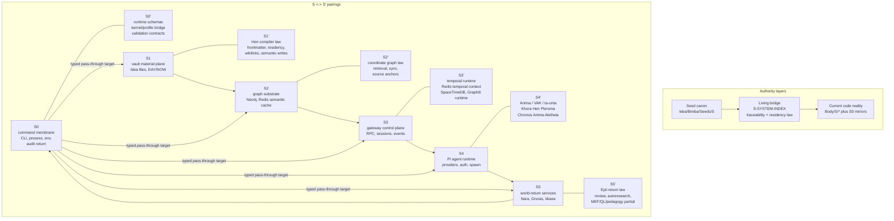
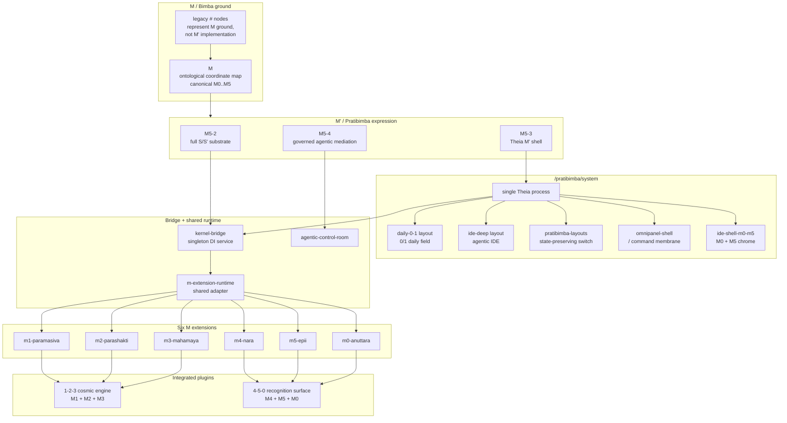
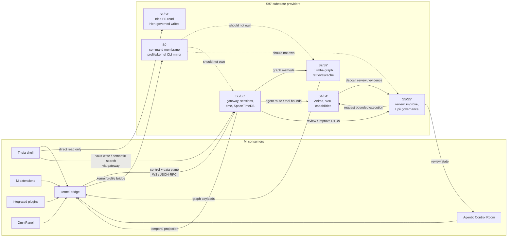
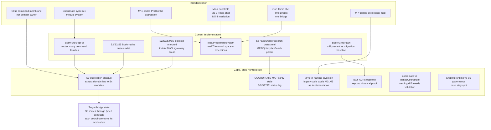

# Architecture Diagram Pack: S/S' and M'

## Status

This is the current wikilinked architecture pack for the full [[S/S']] substrate, the full [[M']] coded expression, and the cross-system coupling between them.

Use it as an agent-first orientation surface before executing implementation work from the M-dev plan set. It is not a replacement for the seed specs. It is a bridge that keeps diagrams tied to the corpus:

- [[S-SYSTEM-INDEX]] remains the S/S' whole-system authority.
- [[S-SOURCE-TRACEABILITY-INDEX]] remains the S/S' source-routing authority.
- [[M'-SYSTEM-SPEC]] remains the M' umbrella authority.
- [[M-M-prime-coordinate-mapping-inaugural]] remains the M versus M' terminology guard.
- [[05-tauri-ide-shell-and-pratibimba-system]] records the active Theia-only recast.

Core invariant: **the coordinate system is the modular system.** [[S0]] is the command membrane and return surface; domain law belongs in its owning coordinate module, not in [[S0]] by convenience.

## Canonical Reading Protocol

Any orchestrator, m-dev-adjacent process, or agentic implementation run must read in this order before scoping work:

1. Read [[World-Ontology]] for the crystallised ontology frame and residency distinction between [[World]], [[Seeds]], and [[World/Types]].
2. Read this [[ARCHITECTURE-DIAGRAM-PACK]] for the top-layer map, cross-cutting surfaces, method ownership, and adjacent-layer seams.
3. Read the umbrella seed: [[S-SYSTEM-INDEX]] for [[S]] / [[S']] work, or [[M'-SYSTEM-SPEC]] for [[M']] work. Shared [[KernelBridge]], [[MathemeHarmonicProfile]], [[Day]], [[NOW]], [[Graphiti]], and capability-matrix concerns live at this umbrella layer before they are consumed by coordinates.
4. Read the exact layer spec: [[S0-SPEC]], [[S1-SPEC]], [[S2-SPEC]], [[S3-SPEC]], [[S4-SPEC]], [[S5-SPEC]], [[S0'-SPEC]], [[S1'-SPEC]], [[S2'-SPEC]], [[S3'-SPEC]], [[S4'-SPEC]], [[S5'-SPEC]], [[M0'-SPEC]], [[M1'-SPEC]], [[M2'-SPEC]], [[M3'-SPEC]], [[M4'-SPEC]], or [[M5'-SPEC]].
5. Read the subcoordinate shard specs inside that layer only after the umbrella and layer spec have fixed ownership.
6. Use migrated legacy sources under `Idea/Bimba/Seeds/**/Legacy/**` as historical or implementation-track evidence only where the seed cites them. If they disagree, the newest mtime in [[LEGACY-DOCS-MIGRATION-INDEX]] explains the landing history, but the seed is the canonical source.

Reading shortcut prohibition: do not grep a plan fragment first, do not treat an `epi` command name as ontology, and do not relocate a shared kernel/profile concern into [[S0]] or [[M0']] because it is easiest to execute or display there. Use [[S-SHARD-HARMONIZATION-PROTOCOL]] when a shard is thin, underlinked, or stale relative to current [[Body]] substrate.

For the Hen-governed path from live diagram/spec evidence into [[World/Types]] MOCs, flat [[World]] crystallisations, and [[S2]] graph-promotion intent, use [[S1'-WORLD-TYPES-CRYSTALLIZATION-PROTOCOL]].

## Internal QL Breakdown Provenance

The internal QL breakdowns in the S seeds are not invented in this pack. They are sourced from three existing strata:

| Stratum | Source | How to use it |
|---|---|---|
| World nexus | [[World-Ontology]] | Supplies the stable navigation hub for [[World]], [[Seeds]], [[World/Types]], root system documents, and the harmonised [[S]] / [[S']] architecture spine |
| World ontology | `Idea/Bimba/World/Types/Coordinates/S/S0/S0.md` through `S5/S5.md`, plus `S/S'/S0'/S0'.md` through `S/S'/S5'/S5'.md` | Supplies `p0_grounds`, `p1_definitions`, `p2_operations`, `p3_patterns`, `p5_integrations`, #5 integration, and #0 return language |
| Layer seed specs | [[S0-SPEC]] through [[S5-SPEC]] and [[S0'-SPEC]] through [[S5'-SPEC]] | Crystallises the World ontology into buildable internal 0-5 breakdowns, API surfaces, envelope/data shapes, privacy classes, seams, and decisions |
| QL/MEF/VAK corpus | [[P]], [[P0]], [[P0']], [[P1]], [[P1']], [[P2]], [[P2']], [[P3]], [[P3']], [[P4]], [[P4']], [[P5]], [[P5']], [[CT0]], [[CT1]], [[CT2]], [[CT3]], [[CT4a]], [[CT4b]], [[CT5]], [[L0]], [[L0']], [[L1]], [[L1']], [[L2]], [[L2']], [[L3]], [[L3']], [[L4]], [[L4']], [[L5]], [[L5']] | Supplies positional, context-template, lens, Night/Klein, and VAK language. If a QL term is used in implementation-facing text, wikilink it unless it is inside code |

For [[M']] layers, the internal QL/M breakdowns live in [[M0'-SPEC]] through [[M5'-SPEC]] and their sibling research specs. This pack may summarise them, but must not mint new M' subcoordinate semantics without a cited seed/source file.

Row-level provenance requirement: every internal S/S' 0-5 table must be read as either direct World ontology, seed-side crystallisation from World prose plus a layer seed, or open/historical. Do not treat a row as canonical if it cannot point to its owning [[World]] coordinate file, a sibling seed, or the shared [[P]] / [[CT]] / [[L]] corpus.

## Wikilink Discipline

Wikilinks are part of the architecture, not decoration. Canonical seed files should wikilink every coordinate, layer, carrier, constitutional agent, subagent, cross-cutting substrate, and recurring decision family when the term is being used semantically rather than as a literal path or method name.

High-value terms that should remain linked across the pack and specs: [[S0]], [[S0']], [[S1]], [[S1']], [[S2]], [[S2']], [[S3]], [[S3']], [[S4]], [[S4']], [[S5]], [[S5']], [[M0']], [[M1']], [[M2']], [[M3']], [[M4']], [[M5']], [[Khora]], [[Hen]], [[Pleroma]], [[Chronos]], [[Anima]], [[Aletheia]], [[Nous]], [[Logos]], [[Eros]], [[Mythos]], [[Psyche]], [[Sophia]], [[Anansi]], [[Moirai]], [[Janus]], [[Mercurius]], [[Agora]], [[Zeithoven]], [[Day]], [[NOW]], [[Continuation]], [[KernelBridge]], [[MathemeHarmonicProfile]], [[Graphiti]], [[Gnosis]], [[Nara]], [[Epii]], [[VAK]], [[CPF]], [[CT]], [[CP]], [[CF]], [[CFP]], [[CS]], [[Capability Matrix]], [[Consent]], and [[S-SYSTEM-INDEX]].

## Ta-Onta Placement Invariant

[[ta-onta]] is the [[S4']] internal carrier set. It is not a separate system beside [[S4']] and not a seventh layer. The six carriers are [[S4.0']] [[Khora]], [[S4.1']] [[Hen]], [[S4.2']] [[Pleroma]], [[S4.3']] [[Chronos]], [[S4.4']] [[Anima]], and [[S4.5']] [[Aletheia]]. The [[VAK]] sequence [[CPF]] / [[CT]] / [[CP]] / [[CF]] / [[CFP]] / [[CS]] is the vertical dispatch grammar that acts through these carriers; it is not the same axis as the carriers themselves.

## Confirmed Current Shape

- [[S0]] / [[S0']] currently provides the `epi` command plane, local execution, kernel/profile bridge surfaces, and typed mirrors.
- [[S1]] / [[S1']] provides [[Idea]] vault residency, [[Hen]] compiler/frontmatter/wikilink law, and governed vault writes.
- [[S2]] / [[S2']] provides `:Bimba` graph, coordinate graph law, retrieval, sync, and semantic cache.
- [[S3]] / [[S3']] provides gateway, sessions, temporal context, Redis temporal state, SpaceTimeDB projection, and [[Graphiti]] runtime.
- [[S4]] / [[S4']] provides PI runtime, [[Anima]], VAK routing, ta-onta modules, and capability governance.
- [[S5]] / [[S5']] provides [[Epii]], review, autoresearch, [[Gnosis]], [[Nara]], kbase, and world-return governance.
- [[M']] currently centers on [[/pratibimba/system]] as one [[Theia]] shell with two layouts, one [[kernel-bridge]], six M extensions, two integrated plugins, and the [[Agentic Control Room]].
- [[Body/M/epi-tauri]] is migration-source-only under the active Theia-only recast; keep it as baseline evidence, not future authority.

## Diagram Wikilink Legend

Mermaid node labels do not create reliable Obsidian backlinks. Treat this legend as the semantic link layer for the diagrams below:

- S/S' coordinates: [[S0]], [[S0']], [[S1]], [[S1']], [[S2]], [[S2']], [[S3]], [[S3']], [[S4]], [[S4']], [[S5]], [[S5']].
- M' coordinates: [[M']], [[M0']], [[M1']], [[M2']], [[M3']], [[M4']], [[M5']].
- S4' / ta-onta carriers: [[ta-onta]], [[Khora]], [[Hen]], [[Pleroma]], [[Chronos]], [[Anima]], [[Aletheia]].
- Constitutional and specialist agents: [[Nous]], [[Logos]], [[Eros]], [[Mythos]], [[Psyche]], [[Sophia]], [[Anansi]], [[Moirai]], [[Janus]], [[Mercurius]], [[Agora]], [[Zeithoven]].
- Cross-cutting substrates: [[KernelBridge]], [[MathemeHarmonicProfile]], [[Day]], [[NOW]], [[Continuation]], [[Graphiti]], [[Gnosis]], [[SpaceTimeDB]], [[Capability Matrix]], [[Consent]], [[Epii]], [[Nara]], [[Pratibimba]], [[Theia]].
- QL/VAK anchors: [[P]], [[P0]], [[P1]], [[P2]], [[P3]], [[P4]], [[P5]], [[P0']], [[P1']], [[P2']], [[P3']], [[P4']], [[P5']], [[CPF]], [[CT]], [[CP]], [[CF]], [[CFP]], [[CS]], [[L0]], [[L1]], [[L2]], [[L3]], [[L4]], [[L5]], [[L0']], [[L1']], [[L2']], [[L3']], [[L4']], [[L5']].

## Diagram 1: System Landscape



This captures the whole field: [[S/S']] substrate, active [[M']] Theia shell, [[kernel-bridge]], agent mediation, and major store/runtime boundaries. It intentionally omits per-method API lists.

## Diagram 2: S/S' Deep Structure



This diagram makes the modular rule explicit: [[S0]] is the executable command/return membrane, not the hidden home for [[S2]], [[S3]], [[S4]], or [[S5]] domain law.

## Diagram 3: M' Deep Structure



This captures [[M']] as one [[Theia]] shell with two layout modes, one bridge, six M extensions, and two integrated plugins. It preserves the [[M]] versus [[M']] inversion guard.

## Diagram 4: Cross-System Coupling



This focuses only on coupling edges: [[M']] consumes; [[S/S']] provides. The dotted edges mark the cleanup seam where [[S0]] currently carries too much mirrored subsystem logic.

## Diagram 5: Implementation Reality vs Canon



This diagram separates canon, current implementation, and unresolved seams. It names active migration zones instead of flattening older Tauri plans, current Theia code, and seed canon into one diagram.

## Architecture Centers Of Gravity

### S/S'

The current architectural center of gravity for [[S/S']] is the six-coordinate return circuit with Body-native modules as the target residency law:

```text
S0 -> S1 -> S2 -> S3 -> S4 -> S5 -> S0
```

The highest-priority correction is to preserve [[S0]] as the command membrane and return surface. `epi` commands may mirror all coordinates, but [[S2]] graph law, [[S3]] gateway/temporal law, [[S4]] agentic law, and [[S5]] review/autoresearch law should live in their own coordinate modules.

### M'

The current architectural center of gravity for [[M']] is [[Idea/Pratibimba/System]]: one [[Theia]] shell, two layout modes, one bridge, six M extensions, two integrated plugins, and governed [[M5-4]] mediation.

[[Body/M/epi-tauri]] remains useful as migration inventory, test baseline, and historical proof, but it is not current architectural authority under the Theia-only recast.

## Highest-Risk Ambiguities

- [[M]] versus [[M']]: [[M]] is the ontological [[Bimba]] map; [[M']] is coded [[Pratibimba]] expression. Legacy code labels can invert this.
- [[S0]] versus coordinate-owned modules: [[S0]] must not become the monolith simply because all commands pass through it.
- [[/body]] versus [[/pratibimba/system]]: older Tauri plans and ADRs are historical; current authority is one [[Theia]] shell with two layouts.
- `coordinate` versus `bimbaCoordinate`: naming drift still needs validation across schema/frontmatter/graph assets.
- [[Graphiti]] placement: runtime belongs to [[S3']], invocation and governance belong to [[S5]] / [[S5']].

## Minimum Durable Diagram Set

Keep these five diagrams as durable architecture docs:

1. [[ARCHITECTURE-DIAGRAM-PACK#Diagram 1 System Landscape]]
2. [[ARCHITECTURE-DIAGRAM-PACK#Diagram 2 S S Deep Structure]]
3. [[ARCHITECTURE-DIAGRAM-PACK#Diagram 3 M Deep Structure]]
4. [[ARCHITECTURE-DIAGRAM-PACK#Diagram 4 Cross-System Coupling]]
5. [[ARCHITECTURE-DIAGRAM-PACK#Diagram 5 Implementation Reality vs Canon]]

## Diagram And MOC Residency Protocol

Architecture diagrams are part of the [[S1]] / [[S1']] content contract. They are not loose illustrations and not renderer-owned assets. [[Hen]] owns their lawful materialisation through residency, frontmatter, wikilink, canvas, and promotion rules; [[S4.1']] consumes that law inside [[ta-onta]] so agent artifacts and M-dev context are born in the right form.

Use this residency split:

- **Seed-level architecture packs** live in `Idea/Bimba/Seeds/**` as sourced [[CT1]] architecture bridges. They may contain Mermaid diagrams and prose synthesis, but must cite the seed/world/source files they summarise. This file is the current whole-system pack.
- **World definition forms** live flat in `Idea/Bimba/World/{Name}.md`. These are pithy, stabilised coordinate definitions, full coordinate synthesis docs, and canonical glossary/form bodies. Do not revive `World/Forms/`.
- **Type/MOC canvases** live under `Idea/Bimba/World/Types/{Type}/{Type}.canvas`, with any type-specific incubation material inside the same type folder. The canvas is the C4 index for the type; process/workspace diagrams inside the type folder are C3 dynamic canvases and must point back to flat World forms or Seed sources.
- **Runtime/product consumption** happens through [[S1']] and [[S2]] surfaces: [[M0']] may render graph/source traceability and M5 routes, [[M5']] may expose canon/review studios, and agents may request context packs, but none of these consumers become the residency authority.

The production flow is:

```text
Present/FLOW or implementation evidence
  -> Seed architecture pack / shard spec
  -> flat World definition form
  -> World/Types MOC canvas and type index
  -> S1' evidence + S2 graph promotion / retrieval
  -> M' shell, M0 graph, M5 canon studio, and agent context consumption
```

Any M-dev tranche that changes system shape should either update an existing durable diagram/MOC artifact or record why no diagram delta was needed. The no-orphan audit must treat missing diagram/MOC ownership as an architecture documentation gap, not as optional polish.

Spec consumption rule: every umbrella or shard spec that relies on a diagram must explicitly link the relevant heading anchor, for example [[ARCHITECTURE-DIAGRAM-PACK#Diagram 2 S S Deep Structure]]. Mermaid node labels are not enough. The owning shard or traceability index must also name the matching [[World/Types]] canvas when one exists.

Crystallisation rule: if a diagram stabilises a durable concept, the concept should be reflected into flat [[World]] and the matching [[World/Types]] MOC/type index through [[S1'-WORLD-TYPES-CRYSTALLIZATION-PROTOCOL]]. Do not move the Seed diagram pack itself into [[World/Types]] just because it is visually useful.

## Future Refinement Order

1. Add a dedicated [[S0]] passthrough / Body-native module extraction diagram.
2. Add per-coordinate API ownership diagrams for [[S2]], [[S3]], [[S4]], and [[S5]].
3. Add [[Theia]] extension activation and readiness-state diagrams.
4. Add review/autoresearch governance state-machine diagrams for [[S5']] and [[M5-4]].
5. Update [[COORDINATE-MAP]] so it no longer lags current [[S0']], [[S3']], and [[S5']] reality.
