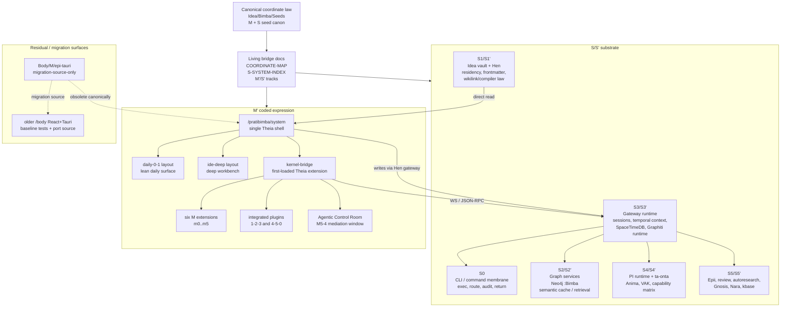
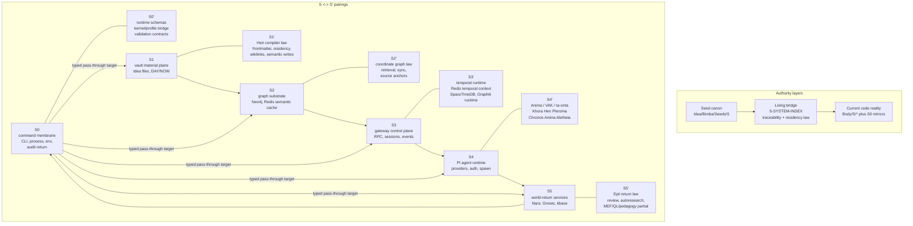
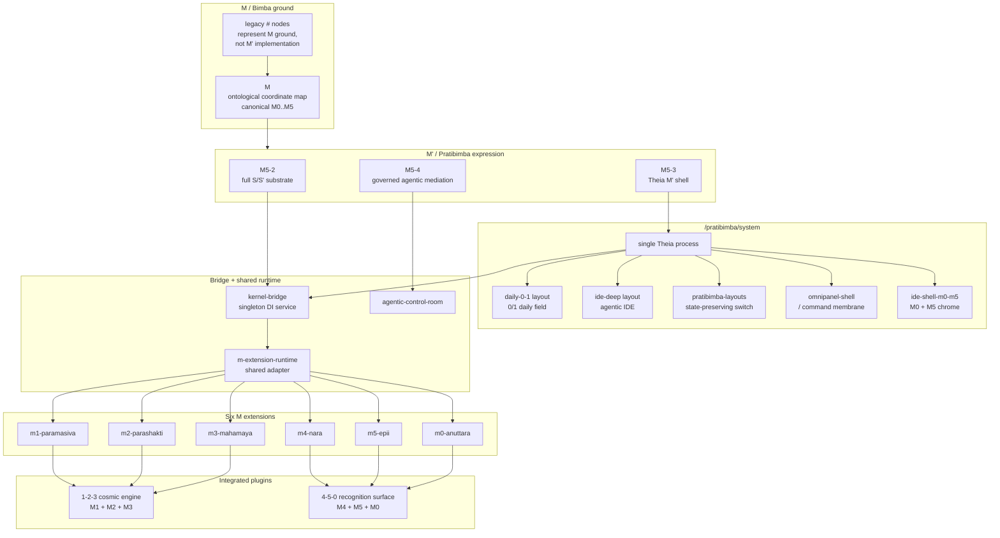
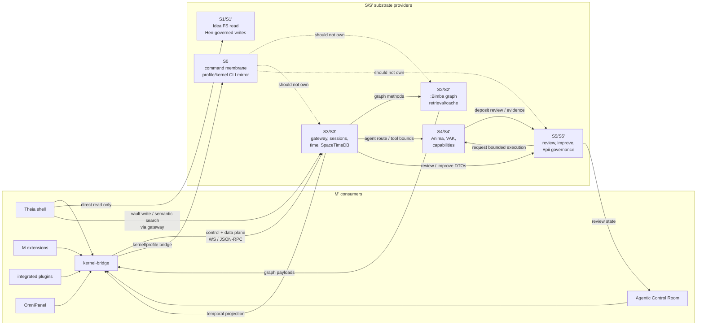
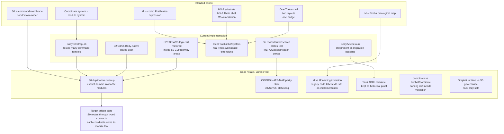

# Architecture Diagram Pack: S/S' and M'

## Status

This is the current wikilinked architecture pack for the full [[S/S']] substrate, the full [[M']] coded expression, and the cross-system coupling between them.

Use it as an agent-first orientation surface before executing implementation work from the M-dev plan set. It is not a replacement for the seed specs. It is a bridge that keeps diagrams tied to the corpus:

- [[S-SYSTEM-INDEX]] remains the S/S' whole-system authority.
- [[S-SOURCE-TRACEABILITY-INDEX]] remains the S/S' source-routing authority.
- [[M'-SYSTEM-SPEC]] remains the M' umbrella authority.
- [[M-M-prime-coordinate-mapping-inaugural]] remains the M versus M' terminology guard.
- [[05-tauri-ide-shell-and-pratibimba-system]] records the active Theia-only recast.

Core invariant: **the coordinate system is the modular system.** [[S0]] is the command membrane and return surface; domain law belongs in its owning coordinate module, not in [[S0]] by convenience.

## Confirmed Current Shape

- [[S0]] / [[S0']] currently provides the `epi` command plane, local execution, kernel/profile bridge surfaces, and typed mirrors.
- [[S1]] / [[S1']] provides [[Idea]] vault residency, [[Hen]] compiler/frontmatter/wikilink law, and governed vault writes.
- [[S2]] / [[S2']] provides `:Bimba` graph, coordinate graph law, retrieval, sync, and semantic cache.
- [[S3]] / [[S3']] provides gateway, sessions, temporal context, Redis temporal state, SpaceTimeDB projection, and [[Graphiti]] runtime.
- [[S4]] / [[S4']] provides PI runtime, [[Anima]], VAK routing, ta-onta modules, and capability governance.
- [[S5]] / [[S5']] provides [[Epii]], review, autoresearch, [[Gnosis]], [[Nara]], kbase, and world-return governance.
- [[M']] currently centers on [[/pratibimba/system]] as one [[Theia]] shell with two layouts, one [[kernel-bridge]], six M extensions, two integrated plugins, and the [[Agentic Control Room]].
- [[Body/M/epi-tauri]] is migration-source-only under the active Theia-only recast; keep it as baseline evidence, not future authority.

## Diagram 1: System Landscape



This captures the whole field: [[S/S']] substrate, active [[M']] Theia shell, [[kernel-bridge]], agent mediation, and major store/runtime boundaries. It intentionally omits per-method API lists.

## Diagram 2: S/S' Deep Structure



This diagram makes the modular rule explicit: [[S0]] is the executable command/return membrane, not the hidden home for [[S2]], [[S3]], [[S4]], or [[S5]] domain law.

## Diagram 3: M' Deep Structure



This captures [[M']] as one [[Theia]] shell with two layout modes, one bridge, six M extensions, and two integrated plugins. It preserves the [[M]] versus [[M']] inversion guard.

## Diagram 4: Cross-System Coupling



This focuses only on coupling edges: [[M']] consumes; [[S/S']] provides. The dotted edges mark the cleanup seam where [[S0]] currently carries too much mirrored subsystem logic.

## Diagram 5: Implementation Reality vs Canon



This diagram separates canon, current implementation, and unresolved seams. It names active migration zones instead of flattening older Tauri plans, current Theia code, and seed canon into one diagram.

## Architecture Centers Of Gravity

### S/S'

The current architectural center of gravity for [[S/S']] is the six-coordinate return circuit with Body-native modules as the target residency law:

```text
S0 -> S1 -> S2 -> S3 -> S4 -> S5 -> S0
```

The highest-priority correction is to preserve [[S0]] as the command membrane and return surface. `epi` commands may mirror all coordinates, but [[S2]] graph law, [[S3]] gateway/temporal law, [[S4]] agentic law, and [[S5]] review/autoresearch law should live in their own coordinate modules.

### M'

The current architectural center of gravity for [[M']] is [[Idea/Pratibimba/System]]: one [[Theia]] shell, two layout modes, one bridge, six M extensions, two integrated plugins, and governed [[M5-4]] mediation.

[[Body/M/epi-tauri]] remains useful as migration inventory, test baseline, and historical proof, but it is not current architectural authority under the Theia-only recast.

## Highest-Risk Ambiguities

- [[M]] versus [[M']]: [[M]] is the ontological [[Bimba]] map; [[M']] is coded [[Pratibimba]] expression. Legacy code labels can invert this.
- [[S0]] versus coordinate-owned modules: [[S0]] must not become the monolith simply because all commands pass through it.
- [[/body]] versus [[/pratibimba/system]]: older Tauri plans and ADRs are historical; current authority is one [[Theia]] shell with two layouts.
- `coordinate` versus `bimbaCoordinate`: naming drift still needs validation across schema/frontmatter/graph assets.
- [[Graphiti]] placement: runtime belongs to [[S3']], invocation and governance belong to [[S5]] / [[S5']].

## Minimum Durable Diagram Set

Keep these five diagrams as durable architecture docs:

1. [[ARCHITECTURE-DIAGRAM-PACK#Diagram 1 System Landscape]]
2. [[ARCHITECTURE-DIAGRAM-PACK#Diagram 2 S S Deep Structure]]
3. [[ARCHITECTURE-DIAGRAM-PACK#Diagram 3 M Deep Structure]]
4. [[ARCHITECTURE-DIAGRAM-PACK#Diagram 4 Cross-System Coupling]]
5. [[ARCHITECTURE-DIAGRAM-PACK#Diagram 5 Implementation Reality vs Canon]]

## Future Refinement Order

1. Add a dedicated [[S0]] passthrough / Body-native module extraction diagram.
2. Add per-coordinate API ownership diagrams for [[S2]], [[S3]], [[S4]], and [[S5]].
3. Add [[Theia]] extension activation and readiness-state diagrams.
4. Add review/autoresearch governance state-machine diagrams for [[S5']] and [[M5-4]].
5. Update [[COORDINATE-MAP]] so it no longer lags current [[S0']], [[S3']], and [[S5']] reality.
