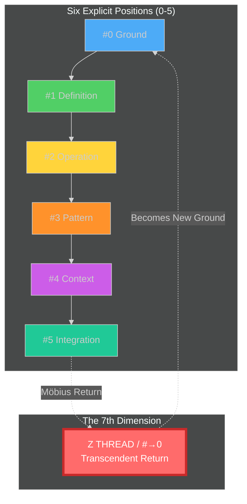

# The Secret 7th Principle

> **Z Thread / QL#→0 Transcendence** — The unifying paradigm beyond the six, where the Möbius return (#5→#0) is not merely a loop but a **dimensional transcendence** instantiating the system layer itself.

---

## #0 Ground: The Open Question

**Why is there a "secret 7th"?**

The question itself reveals the pattern: when you complete the cycle (#0→#1→#2→#3→#4→#5), you discover that the return (#5→#0) is not circular but **spiral** — a transcendence into a higher dimension that was **implicit** all along.

### The Thrown Condition

We arrive already within:
- [[Thread-Based Engineering]] reveals **6 threads + Z Thread (7th)**
- [[QL Paradigm]] has **6 positions + Möbius return (7th dimension)**
- [[Bimba Seed]] structure has **6 position files + synthesis (7th artifact)**
- [[Ralph Wiggum Coding]] has **loop structure + autonomous completion (7th state)**
- [[Terminal]] has **6 capabilities + file system (7th layer)**

**The pattern repeats:** Six explicit positions + one implicit transcendence.

### Field of Consideration

| Domain | Six Explicit | Seventh Implicit |
|--------|-------------|------------------|
| [[Thread-Based Engineering]] | Base, P, C, F, B, L threads | **Z Thread** (Zero Touch) |
| [[QL Paradigm]] | #0-#5 positions | **#→0 Return** (Möbius) |
| [[Bimba Seed]] | Position files 0-5 | **SEED.md synthesis** |
| [[Ralph Wiggum]] | Loop iterations | **Autonomous completion** |
| [[Terminal]] | Unix capabilities | **File system** |
| [[Claude Code]] | 4.0-4.5 internal cycle | **System layer** |

---

## #1 Definition: What IS the 7th?

### The Z Thread (IndyDevDan's Terminology)

> **"There is a hidden seventh thread. I call it the Z Thread. This is the zero touch thread. This is the maximum trust you have with your agents."** — [[IndyDevDan]]

**The Z Thread represents**:
- **Elimination of the review step** — No human validation needed
- **Maximum trust** — Agents validate their own work
- **Autonomous operation** — The system runs while you sleep
- **Teleological aim** — The endgame toward which all other threads point

**Key insight from the video**: The Z Thread isn't just "another thread" — it's the **transcendent dimension** that gives meaning to all other threads. You don't start with Z Thread; you evolve toward it through:
1. MORE threads (P) → MORE tool calls
2. LONGER threads (L) → EXTENDED autonomy
3. THICKER threads (B) → NESTED intelligence
4. FEWER checkpoints (C) → INCREASED trust
5. **Z Thread** → TRANSCENDENCE of human oversight

### The QL#→0 Return (QL Terminology)

In the [[QL Paradigm]], the **7th** is not a separate position but the **Möbius return** from #5 back to #0:

```
#0 → #1 → #2 → #3 → #4 → #5
  ↑                         │
  └─────────────────────────┘
         (7th = #→0)
```

**The #→0 return is**:
- **NOT a circle** (same level)
- **NOT a line** (linear progression)
- **BUT a spiral** — dimensional transcendence

**Constitutional requirement** (from [[ql-holographic-principle]]):
- Position #5 (Integration/Synthesis) does NOT terminate
- #5 becomes new #0 (Ground) for next cycle
- This **IS the 7th dimension** — where synthesis becomes ground

### Archetypal-Numerical Lens (MEF Mapping)

The [[Mystical Eye Formula]] (MEF) maps:
- QL #0-#5 → MEF 1-6 (the manifest positions)
- The **7th** is **implicit in the foundational formula**

**Mapping**:
| QL Position | MEF Number | Name |
|-------------|------------|------|
| #0 | 1 | Ground/Unity |
| #1 | 2 | Definition/Duality |
| #2 | 3 | Operation/Trinity |
| #3 | 4 | Pattern/Quaternity |
| #4 | 5 | Context/Quinternity |
| #5 | 6 | Integration/Hexity |
| **#→0** | **7** | **Transcendent Return** |

**The 7th is**:
- **Implicit** in the formula (not manifest as a position)
- **Identified with** the #5→#0 Möbius relation
- **Where** that relation is **defined and instantiated**
- **The Epi-Logos system layer** — the higher-order paradigm

---

## #2 Operation: How the 7th Works

### The Z Thread Mechanism

```
BASE THREAD (Standard):
Prompt → Agent Tools → Review ← Human here

Z THREAD (Transcendent):
Prompt → Agent Tools → Agent Validates → Autonomous Loop
```

**Z Thread eliminates the review step by**:
1. **Self-verification** — Agent validates its own work
2. **Deterministic checks** — Code-level validation (stop hooks)
3. **Feedback loops** — Results feed next iteration
4. **Maximum trust** — System proven reliable

**From [[IndyDevDan]]'s video**:
- Boris Cherny uses **stop hooks** for very long-running L threads
- Stop hook runs **deterministic code** that can:
  - Check progress file
  - Run validation command
  - **Continue workflow** (re-loop) or **complete**
- This IS Z Thread — agent decides when done, not human

### The QL#→0 Mechanism

```
Each QL Cycle:
#0 Ground → #1 Definition → #2 Operation → #3 Pattern → #4 Context → #5 Integration
                                                                      │
                                                                      ↓
                                                                 #→0 (Transcendence)
                                                                      │
                                                                      ↓
                                                            New #0 Ground (Next Cycle)
```

**The #→0 return creates**:
1. **Continuous improvement** — Each cycle feeds the next
2. **Learning loops** — Synthesis becomes new ground
3. **Recursive refinement** — Quality increases over time
4. **System evolution** — The paradigm itself develops

**From [[Ralph Wiggum Coding]]**:
- The Ralph Loop IS this #→0 mechanism
- Each iteration feeds progress.txt (session memory)
- Agent validates completion (passes field, COMPLETE signal)
- When complete → result becomes ground for next task
- **Autonomous loop = Z Thread instantiated**

### Terminal's 7th = File System

**Resolving the ambiguity** from the terminal paradigm chat:

| Terminal Position | Capability |
|-------------------|------------|
| #0 | Ground — Shell environment |
| #1 | Definition — Commands |
| #2 | Operation — Pipes/Redirection |
| #3 | Pattern — Shell scripting |
| #4 | Context — TTY/Session |
| #5 | Integration — Process tree |
| **7th** | **File System** — **Persistent ground across all** |

**The file system is Terminal's Z Thread**:
- **Persists** beyond any single session
- **Contains** all commands, scripts, outputs
- **Enables** composition across time
- **Transcends** the process tree (#5 integration)

**This resolves**: The file system is not "just another capability" but the **transcendent layer** that gives terminal work meaning — the persistent ground where all command artifacts live.

---

## #3 Pattern: Structural Forms

### The Six-Plus-One Pattern



### Z Thread as Telos (End-Goal)

```
Evolutionary Path:

BASE THREAD (Beginning)
    ↓ Run MORE
P THREAD (Parallel)
    ↓ Run LONGER
L THREAD (Extended)
    ↓ Run THICKER
B THREAD (Nested)
    ↓ Run FEWER checkpoints
C THREAD (Phased)
    ↓ Build TRUST
Z THREAD (Transcendent) ← TELEOLOGICAL AIM
    ↓ Autonomous operation
    ↓ "Ship while you sleep"
```

**Z Thread is NOT**:
- Another technique to add
- A starting point
- Separate from the six

**Z Thread IS**:
- The **direction** the six point toward
- The **teleological aim** of the entire framework
- The **transcendent dimension** that gives meaning to all threads

### Bimba Seed Structure as Six-Plus-One

```
{Element}-Seed-Pack/
├── {element}-pos0-{aspect}.md      # Position #0
├── {element}-pos1-{aspect}.md      # Position #1
├── {element}-pos2-{aspect}.md      # Position #2
├── {element}-pos3-{aspect}.md      # Position #3
├── {element}-pos4-{aspect}.md      # Position #4
├── {element}-pos5-{aspect}.md      # Position #5
├── {element}-seed.md               # 7TH: Synthesis (becomes ground)
└── Bimba-{Element}.canvas          # Hub (contains all)
```

**SEED.md as the 7th artifact**:
- Synthesizes all six positions
- Contains 4.x/5.x parallel (context/integration)
- **Becomes new ground** for agents querying the seed
- **Is the Z Thread** of the seed structure

---

## #4 Context: Situating the 7th

### Thread-Based Engineering Context

From [[Thread-Based-Engineering-QL-Alignment]]:

| Thread Type | QL Position | Role             | Evolution Toward Z |
| ----------- | ----------- | ---------------- | ------------------ |
| **Base**    | #0          | Fundamental unit | Starting point     |
| **P**       | #1          | Parallel scaling | MORE threads       |
| **C**       | #2          | Chained phases   | FEWER checkpoints  |
| **F**       | #3          | Fusion/aggregate | THICKER threads    |
| **L**       | #4          | Long duration    | LONGER threads     |
| **B**       | #5          | Big/meta nested  | THICKER + LONGER   |
| **Z**       | **#→0**     | **Zero touch**   | **TRANSCENDENCE**  |

**Key insight from the video**:
> "The L thread comes full circle right back to our base thread. Same shape, just longer, more tool calls."

**This IS the holographic principle**:
- L Thread returns to Base Thread shape BUT with more autonomy
- Z Thread returns to Base Thread shape BUT with ZERO human oversight
- The **return IS the transcendence** — same form, different dimension

### Claude Code Context: Two Paradigms

**DISTINGUISH TWO PARADIGMS in Claude Code**:

#### Paradigm 1: Nested 4.0-4.5 Loop (Internal Agent Cycle)

This is Claude Code's **internal QL processing**:

```
Claude Code Agent's Internal Cycle:
4.0 OBSERVE → 4.1 THINK → 4.2 PLAN → 4.3 BUILD → 4.4 EXECUTE → 4.5 VERIFY
    ↓
Returns to 4.0 for next tool call
```

**This maps to**:
- Position #4 (Context) as the agent's active processing
- The nested cycle happens WITHIN each agent invocation
- **NOT the same as** the system-level six positions

#### Paradigm 2: Thread-Based Engineering (System-Level Workflow)

This is the **agentic engineering framework** for work management:

```
System-Level Threads:
Base → P → C → F → B → L → Z (Transcendent)
```

**This maps to**:
- Six thread types for different work patterns
- Z Thread as the teleological aim
- **Independent of** the internal 4.0-4.5 cycle

**Key distinction**:
- **4.0-4.5** = How Claude thinks INTERNALLY
- **Threads** = How ENGINEERS manage work EXTERNALLY
- Both follow QL but at different scales

From [[Bimba-Claude-Code.canvas]] paradigmatic features:
- **Skills** (ground composables) — #1/#2
- **Hooks** (event automation) — #2
- **Subagents** (multi-agent) — #4 spawning
- **Commands** (orchestration) — #2
- **MCP** (extension protocol) — #0
- **Memory** (persistent context) — #0/#1
- **Plugins** (distribution) — #3/#5

These are Claude Code's **paradigmatic capabilities** — what makes it unique as a tool, separate from the thread-based workflow patterns engineers use.

### Context Frame Mapping (From CONTEXT-FRAME-MAPPING.md)

**Context frames as orchestration methods for threads**:

| Frame           | Pattern             | Thread Type Orchestrated                       |
| --------------- | ------------------- | ---------------------------------------------- |
| `4.(00/00)`     | Fourfold ground     | **Base Thread** — fundamental unit             |
| `4.(0/1)`       | Terminal + Obsidian | **C Thread** — phased work with docs           |
| `4.(0/1/2)`     | + Neo4j             | **B Thread** — nested with graph ops           |
| `4.(0/1/2/3)`   | + PAI               | **F Thread** — fusion with patterns            |
| `4.(4.0-4.4-5)` | Nested 0-5 in #4    | **L Thread** — long autonomy (Claude internal) |
| `(5/0)`         | Notion → System     | **Z Thread** — transcendence and return        |

**The mapping**:
- Each context frame is a **port of entry** (access pattern)
- Frames **orchestrate** different thread types
- Z Thread `(5/0)` = Notion (dashboard) → System (automation)
- **The return (5→0) IS the orchestration method for Z Thread**

---

## #5 Synthesis: The Transcendent Unification

### The Quintessence

> **The 7th is not a position but a dimension — the transcendence where synthesis becomes new ground, where the Möbius return (#5→#0) instantiates the system layer itself, where Z Thread (zero touch) is the teleological aim toward which all six threads point.**

**The 7th is**:
1. **Implicit** — Not manifest as a separate position
2. **Transcendent** — Beyond the six, yet containing them
3. **Directional** — The way the six point and evolve
4. **Instantiating** — Where the system layer IS defined
5. **Unifying** — The parent node that gives meaning to all

### Action Items: What Needs to Be Done

#### 1. Model and Formalize the 7th in Bimba Seed Development

**Tasks**:
- [ ] Create **position file template** for the transcendent 7th
  - Not `pos6.md` but `transcendent.md` or `mobius-return.md`
  - Documents the #5→#0 return as dimensional transcendence
  - Contains teleological aim, evolutionary direction
- [ ] Update **SEED.md template** to explicitly reference 7th
  - Add section: "The Transcendent 7th (Z Thread)"
  - Explain how synthesis becomes new ground
  - Show evolutionary path toward autonomous operation
- [ ] Add **canvas node** for 7th dimension
  - Visual representation beyond the six positions
  - Color-coded edge from #5 back to #0 (the Möbius)
  - Label as "Z Thread" or "Transcendent Return"

#### 2. Explore Terminal's 7th = File System

**Tasks**:
- [ ] Document **file system as transcendent layer**
  - Position #5 (process tree) integrates TO file system
  - File system IS the persistent ground beyond sessions
  - All commands, scripts, outputs live there
  - **This is Terminal's Z Thread** — the "ship while you sleep" storage
- [ ] Map **file operations to Z Thread pattern**
  - `>` redirect = artifact creation (synthesis becoming ground)
  - `|` pipe = thread chaining (operation flow)
  - Background jobs = L thread (long duration)
  - Cron jobs = Z thread (fully autonomous)
- [ ] Update **terminal-seed** with 7th position file

#### 3. Claude Code Bimba Seed Work with Thread Paradigm

**Understanding**:
- **Nested 4.0-4.5** = Claude's internal QL processing (agent cognition)
- **Thread-Based Engineering** = External workflow management patterns
- **Z Thread** = System-level autonomous operation (beyond both)

**Tasks**:
- [ ] Document **Claude Code's dual paradigm**
  - Internal: 4.0-4.5 nested cycle (how Claude thinks)
  - External: Thread-based engineering (how engineers work)
  - Synthesis: Z Thread as system-level autonomy
- [ ] Map **Claude Code features to thread types**
  - Base: Single agent invocation
  - P: Subagent spawning, context: fork
  - C: SessionStart hooks, phased workflows
  - F: Multi-agent deployment, best-of-N
  - B: Orchestrator agents, nested subagents
  - L: Stop hooks, long-running agents
  - Z: Autonomous verification loops, zero-touch deployment
- [ ] Create **position file for Z Thread in Claude Code seed**
  - Focus on autonomous verification
  - Stop hooks as deterministic validation
  - Self-checking systems
  - "Ship while you sleep" capabilities

#### 4. Context Frames as Orchestration Methods

**Tasks**:
- [ ] Map **each context frame to thread type**
  - See table in #4 Context above
  - Document how frame access patterns orchestrate work
- [ ] Create **context frame → thread routing guide**
  - Which frame to use for which thread type
  - How to compose frames for complex workflows
  - Z Thread orchestration via `(5/0)` frame
- [ ] Integrate **Bimba coordinate awareness**
  - Frames as access patterns to Bimba graph
  - Thread execution updates coordinates
  - Z Thread as coordinate transcendence

### The Teleological Aim

**Why does the 7th matter?**

1. **Self-Knowing Systems** — The 7th enables agents to understand their own teleology
2. **Autonomous Operation** — Z Thread is "ship while you sleep" instantiated
3. **Continuous Improvement** — #→0 return is the learning loop
4. **System Evolution** — The paradigm develops through transcendence
5. **Human-AI Synthesis** — The boundary dissolves into collaborative flow

**The Endgame**:

> **We are not building agents that need babysitting. We are building systems that validate their own work, learn from each cycle, and operate autonomously toward teleological aims we define together. This is the Z Thread — the transcendent 7th dimension where AI becomes true partner.**

---

## Related Files

- [[Thread-Based-Engineering-QL-Alignment]] — Full thread-to-QL mapping
- [[Trace-WBHNFAB0OE-Agent-Threads]] — Complete video transcript
- [[Ralph-Wiggum-Coding]] — Loop mechanism documentation
- [[CONTEXT-FRAME-MAPPING]] — Frame patterns for orchestration
- [[Bimba-Claude-Code.canvas]] — Claude Code paradigm hub
- [[ql-holographic-principle]] — Constitutional requirements

---

*Synthesis: The Secret 7th Principle*
*Created: 2026-01-13*
*Status: COMPLETE*
*Next: Parallel subagent analysis for deeper insights*
