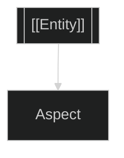

## #0 Ground
<!-- AI: Dataview index | USER: Capture space -->

| Capture | Type | Context |
|---------|------|---------|
| | | |

**Associations:**
-

---

## #1 Definition
<!-- AI: Task tracker | USER: Core prose -->

---

## #2 Operation
<!-- AI: Operations log | USER: Methods/contrasts -->

### Methods
-

### Contrasts
| This | vs | That |
|------|-----|------|
| | | |

---

## #3 Pattern
<!-- AI: QL diagrams | USER: Visual structure -->

---

## #4 Context
<!-- AI: Learning history | USER: Activity space -->

### Timeline
- **Origin**:
- **Current**:

### Activity
-

---

## #5 Synthesis
<!-- AI: Status/handoffs | USER: Quintessence -->

> **Quintessence**:

**Teleological Aim**:
