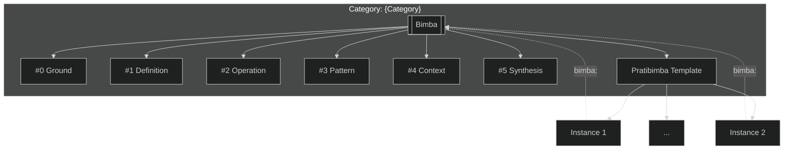

# Position 3 - Pattern

> **AI**: QL-aligned diagrams mapping identity, flows, networks
> **USER**: Local graph, command library, canvas prompts, galleries

---

## Pattern Index

```dataview
TABLE WITHOUT ID
  file.link as "Entity",
  p3_patterns as "Patterns",
  p3_archetypes as "Archetypes",
  p3_symbols as "Symbols"
FROM ""
WHERE bimba = this.file.folder AND (p3_patterns != null OR p3_archetypes != null)
```

---

## Archetype Groupings

```dataview
LIST FROM ""
WHERE bimba = this.file.folder AND p3_archetypes != null
FLATTEN p3_archetypes as archetype
GROUP BY archetype
```

---

## Category Network



---

## Notes

<!--
AI/User notes space - pattern observations, archetype discoveries,
symbolic encapsulations, contextual instantiation galleries, etc.
-->


---

*Position View: #3 Pattern*
*See [[MOC-Bimba-Paradigm]] for context*
