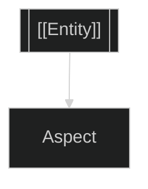

> **NOTE**: This template has been superseded by canonical World templates in Idea/Bimba/World/. See CT*.md, Seed.md, Pattern-Note.md for active templates.

<!--
# ═══════════════════════════════════════════════════════════════════
# PRATIBIMBA TEMPLATE - Instance Authoring Surface (ARCHIVED)
# ═══════════════════════════════════════════════════════════════════
# This template is used to create instances of the {Category} type.
# Each instance links back to its Bimba (category hub) via the
# `bimba:` frontmatter field.
# ═══════════════════════════════════════════════════════════════════

# Core Identity
uuid: ""
created: "{{date}}"
name: ""
title: ""
type: note

# Category Link (CRITICAL - connects instance to Bimba hub)
bimba: "[[{Category}]]"

# ═══════════════════════════════════════════════════════════════════
# POSITION #0: GROUND - Relational Field
# ═══════════════════════════════════════════════════════════════════
p0_grounds:
p0_adjacencies:

# ═══════════════════════════════════════════════════════════════════
# POSITION #1: DEFINITION - Material Content
# ═══════════════════════════════════════════════════════════════════
p1_definitions:
p1_materials:

# ═══════════════════════════════════════════════════════════════════
# POSITION #2: OPERATION - Processes/Skills
# ═══════════════════════════════════════════════════════════════════
p2_operations:
p2_skills:

# ═══════════════════════════════════════════════════════════════════
# POSITION #3: PATTERN - Forms/Archetypes
# ═══════════════════════════════════════════════════════════════════
p3_patterns:
p3_archetypes:
p3_symbols:

# ═══════════════════════════════════════════════════════════════════
# POSITION #4: CONTEXT - Temporal/Spatial/Cultural
# ═══════════════════════════════════════════════════════════════════
p4_temporals:
p4_spatials:
p4_culturals:

# ═══════════════════════════════════════════════════════════════════
# POSITION #5: INTEGRATION - Synthesis/Crystallization
# ═══════════════════════════════════════════════════════════════════
p5_integrations:
p5_crystallizations:

---

## #0 Ground

> **Gather** connections, related entities, the "thrown condition"

| Capture | Type | Context |
|---------|------|---------|
| | | |

**Associations:**
-

---

## #1 Definition

> **Define** the core substance - what this entity IS

<!-- Main prose content goes here -->

---

## #2 Operation

> **Document** how it works - methods, processes, contrasts

### Methods
-

### Contrasts
| This | vs | That |
|------|-----|------|
| | | |

---

## #3 Pattern

> **Diagram** the structural form that emerges

---

## #4 Context

> **Situate** temporally, culturally, spatially

### Timeline
- **Origin**:
- **Current**:

### Activity
-

---

## #5 Synthesis

> **Crystallize** the quintessential expression

> **Quintessence**:
> [One sentence distillation]

**Teleological Aim**:

---

*Pratibimba of [[{Category}]]*
