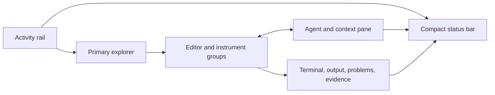

# Pratibimba Workbench Redesign Brief

## Product Thesis

Pratibimba should be a coordinate-native IDE and agent harness: one desktop environment where a person can orient in [[M0']]-[[M4']], work deeply in [[M5']], and see the underlying [[S]]/[[S']] organism act without being forced to read its implementation ledger.

The redesign is a shell recomposition over real existing bodies. It is not a visual reskin and not a request to replace production substrate with fixtures.

## Stable Workbench Geometry



| Region | Stable responsibility |
|---|---|
| Title/workspace bar | Current workspace, coordinate, session, command ingress, layout controls |
| Activity rail | Home, Explorer, Search, Graph, Agents, Changes/Review, Health, Settings |
| Primary explorer | Files, coordinates, graph neighbourhood, sessions, tasks, or changes according to selected activity |
| Editor groups | Text, graph, visual instrument, diff, review, and focused work surfaces |
| Agent/context pane | Conversation, task definition, selected context, run/tool stream, approvals |
| Bottom panel | Terminal, output, problems, tests, evidence, diagnostics |
| Status bar | Profile/generation, session, privacy, gateway, required-service health, active agent/run |

Every region can collapse or resize, but its semantic role does not change. A graph, diff, visual instrument, and canon document are editor objects. A gateway is never an editor tab.

## Navigation Model

### Workspaces, Not Tab Universes

The top-level workspace switcher contains:

- Home / `0-1` daily field;
- [[M0']] Map;
- [[M1']] Relation Walk;
- [[M2']] Correspondence;
- [[M3']] Cosmos;
- [[M4']] Continuity;
- [[M5']] Workbench.

Changing workspace changes the default explorer, editor arrangement, agent mode, and available inspectors while retaining the same active session and work context. Users may open artifacts from one workspace in another without cloning state.

### Coordinate As Context Spine

A coordinate selection should update one shared context object:

```text
coordinate + owning layer + source anchors + graph neighbourhood
+ open artifacts + active session + active task/run + evidence/review state
```

That object drives breadcrumbs, explorer selection, agent context, status, and deposit destination. The coordinate is therefore operational navigation, not a family of permanent tabs.

### Daily `0/1` Field

- `0` defaults to the live cosmic instrument, current profile, and a concise structural orientation.
- `1` defaults to NOW, current session, personal continuity, and pending review/return.
- `/` is expressed through the agent pane, command palette, operational panel, and status bar.
- Deep work opens in the six named workspaces without losing the daily context.

## [[M5']] Agent Workbench

The first complete agent-led flow should be:

1. Create or resume a task from conversation.
2. Select mode and authority before execution.
3. Inspect and edit the context set: files, coordinates, graph nodes, sessions, and evidence.
4. Follow agent messages and collapsible tool events beside the active editor.
5. Approve risky actions at the point of execution.
6. Inspect changed files in a Changes explorer.
7. Review real diffs in an editor group and selectively accept or request revision.
8. Run tests and attach typed evidence.
9. Make the human-required review/promotion decision.
10. Deposit the result and resume later with the same lineage.

Initial [[M5']] editor types:

- Canon and code editor;
- diff/review editor;
- terminal;
- test/evidence result;
- graph/source inspector;
- rendered frontend preview when a real body exists.

Library, Canon Studio, Backend Studio, Frontend Studio, Agentic Control Room, and Logos Atelier become explorer views, editor types, or workspace presets. They should not be six prose landing pages.

## Runtime Contract

The native app should supervise one desktop runtime profile and reveal the workbench only after:

```text
runtime resolved
-> gateway protocol handshake
-> first valid profile generation
-> vault root resolved
-> workbench ready
```

Required services block startup with a repair action. Optional or workspace-specific services create a degraded state that is summarized in the status bar and explained in Organism Health. The startup receipt must originate from the native carrier that the user launched.

## Preserve, Recompose, Retire

### Preserve

- gateway/profile transport and typed contracts;
- command registry and palette;
- CodeMirror Canon Studio and Tiptap NOW editor;
- vault tree and governed writes;
- sessions, chat, graph, oracle, profile-driven instruments;
- provenance, readiness, and intent stores;
- behavioral real-gateway and real-filesystem tests.

### Recompose

- four face/layout models into workspace presets;
- OmniPanel functions into agent, bottom-panel, status, health, and settings roles;
- coordinate panes into one context/explorer system;
- review and evidence around real tasks and changes;
- subsystem bodies into editor types and inspectors.

### Retire From Primary UI

- internal component ids;
- tranche and decision-register narration;
- raw source paths as product copy;
- named-unbuilt paragraphs;
- full-width readiness essays;
- one peer tab per coordinate concept;
- gateway and diagnostics as editor documents.

Technical evidence remains available in diagnostics and provenance inspection.

## Implementation Checkpoint - 2026-08-04

[[13-phase-a-b-foundation-receipt]] records the first implementation pass.

- Phase A's minimum truthful boot chain is landed: compatible binary resolution and stale-config repair, status hydration, native reveal gating through supervisor/handshake/profile/vault truth, and a native-origin workbench receipt.
- Phase B's stable frame is landed: one workspace bar, activity rail, existing explorer/editor/agent hosts, a real-data operational panel, compact status, and persisted Home plus [[M0']]-[[M5']] presets.
- Existing pane bodies and four face/layout models are preserved inside the frame while migration continues; no old surface was deleted merely to make the skeleton look complete.
- The required/optional organism service graph, full persisted-layout migration policy, and complete [[M5']] work loop remain open. This checkpoint closes neither Phase B nor Phase C.

## Delivery Sequence

Before any phase below can close, it must satisfy [[07-cycle3-inheritance-contract]]. The redesign may recompose carrier surfaces aggressively, but it may not recreate or relocate landed substrate merely because the current shell makes that substrate difficult to see.

### Phase A - Runtime Truth

- repair and validate binary resolution;
- define required/optional desktop runtime services;
- add handshake/profile/vault readiness gating;
- replace the false-positive native boot receipt;
- add stale-config and degraded-service recovery tests.
- snapshot and preserve the Cycle 3 gateway-method and live-wire ratchets before changing startup ownership.

### Phase B - Workbench Skeleton

- introduce the stable seven-region shell;
- create Home plus visible [[M0']]-[[M5']] workspace switching;
- implement Activity rail, explorer contracts, editor groups, bottom panel, and compact status;
- migrate persisted layouts without silently losing user arrangements.
- inventory every removed legacy tab/pane against its new workbench destination; retain existing functional pane bodies during migration.

### Phase C - Complete [[M5']] Loop

- task composer and resumable task identity;
- selected context and authority model;
- integrated agent/tool/approval stream;
- terminal, changes, diff, tests/evidence, review, and deposit;
- one real end-to-end governed change workflow.

### Phase D - Coordinate Workspaces

- recompose [[M0']]-[[M4']] around their primary work objects;
- remove duplicate shell/deep surface inventories;
- verify cross-workspace coordinate, session, profile, and evidence continuity.

### Phase E - Product Quality

- keyboard and accessibility pass;
- dense and empty content stress tests;
- responsive minimum-size and multi-monitor tests;
- visual hierarchy, motion, audio, and performance tuning;
- canon drift repair and final DOX alignment.

## Acceptance Criteria

The redesign is credible when all of these are true:

1. A first-time user can identify workspace, current work object, agent state, and next action without reading implementation prose.
2. Native launch proves its own gateway handshake, first profile generation, vault readiness, and mounted workbench.
3. A task can move from prompt through context, tools, changed files, diff, tests, evidence, human decision, and deposit in one visible lineage.
4. [[M0']]-[[M5']] are discoverable workspaces with distinct primary work objects, not tab lists.
5. Switching face or workspace preserves unsaved artifacts, coordinate, session, active run, and pending review.
6. Missing optional substrate is concise, localized, actionable, and inspectable in one health view.
7. Privacy and promotion boundaries are tested with real filesystem and gateway behavior.
8. Automated checks include native startup failure, workflow completion, keyboard navigation, resizing, zoom, and meaningful real-content states.

## Decision Required Before Implementation

The architecture should be ratified as **one stable workbench with coordinate workspace presets**. Rebuilding each face and coordinate as its own independent tab universe would reproduce the present failure under a new visual style.
