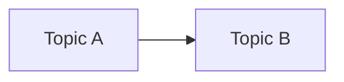

# [[01-06-2026]]

> [[FLOW]] | [[Empty/Present/01-06-2026]]

## Sessions

<!-- Khora appends [[NOW-{sessionId}]] here on each session_start -->

---

## #0 Ground — Capture
<!-- GATHER: Raw input, fragments, synthesis from yesterday — establish temporal horizon -->

| ID | Capture | Type | Context | Time |
|----|---------|------|---------|------|
| 1. ^e1 | | | | |

**Quick thoughts:**
-

---

## #1 Definition — Tasks
<!-- DEFINE: What defines this day? What must happen? -->

### Must Do
- [ ]

### Should Do
- [ ]

### Could Do
- [ ]

### Completed

---

## #2 Operation — Sessions
<!-- OPERATE: What happened? Log sessions and manual activity -->

### Claude Sessions

| Session | Time | Commit | Files Changed |
|---------|------|--------|---------------|

### Manual Activity
-

---

## #3 Pattern — Observations
<!-- PATTERN: What structures emerged? What is this day's archetype? -->

### Patterns Noticed
-

### Recurring Themes
-

### Connections Made

---

## #4 Context — Structure
<!-- SITUATE: The day's structural footprint and nested contexts -->

### Timeline
- **Morning**:
- **Afternoon**:
- **Evening**:

### Files Touched

### Concepts / People Engaged

### Graph Additions

---

## #5 Synthesis — Crystallization
<!-- CRYSTALLIZE: What did this day reveal? Seed tomorrow's ground -->

### Key Learnings
1.

### Blockers / Open Questions
-

### Tomorrow's Focus
- [ ]

> **Today's Quintessence**:
>

**Teleological Aim** — What was this day moving toward?

<!-- Archive gate: set c_5_reflection_complete: true before chronos_archive_day -->
