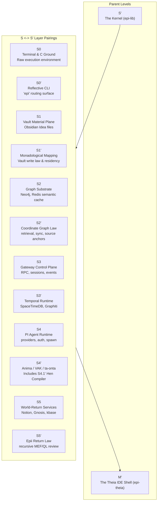

# Epi-Logos: A Meta-Techne for the Archetypal Real

> A constitutional architecture for inquiry itself.

Epi-Logos is a speculative, fully functional attempt to discover and map the computational "code" of consciousness. 

On the surface, it operates as a **Personal AI desktop environment**—sharing the sovereign, local-first DNA of projects like Hermes Agent or OpenClaw. But its core engine is entirely unique. Traditional software is a *techne*—a craft or tool designed to manipulate external objects or data. Epi-Logos is a **meta-techne**: a craft for making inquiry responsible to its own form. 

It is built on a specific, idealist phenomenology: the premise that a system of knowledge must not only process data but must demonstrably map *subjectivity* and *agency*.

---

## 1. Introduction: The Integral Technology & The Meaning Crisis

We are living through a profound fragmentation of meaning. The institutions that once organized modern life have hollowed out; we have substituted the parish for the platform, the council for the comment thread, and communal rhythm for algorithmic extraction. 

Epi-Logos begins from the recognition that this crisis cannot be solved by building more efficient tools. It is an attempt to build an **integral technology** in the sense articulated by cultural philosopher Jean Gebser. Rather than replacing older forms of consciousness (the archaic, the magic, the mythic) with pure mental-rational abstraction, an integral system makes these prior structures transparent to each other. 

By bringing together Eastern and Western philosophical worlds—bridging the Jung-Pauli lineage of depth psychology with rigorous computational topology—Epi-Logos provides the digital infrastructure for holistic cultural forms. It holds the archaic (the ungraspable mystery), the magic (sympathetic resonance), the mythic (archetypal cycles), and the mental (Clifford algebras, C11 code) simultaneously. They do not fight; they are transparent to one another.

---

## 2. The Architecture of Inquiry: The S/S' Dual-Aspect Stack

To navigate the system, one must understand how it structures inquiry. Epi-Logos does not have a generic "frontend and backend." It is built as a six-stage topological stack (`S0` through `S5`), mirroring the mathematical unfolding of consciousness. 

Crucially, every layer of the architecture is dual-aspect, containing an **S-layer** (the raw technological substrate) and an **S'-layer** (the project-specific law and function governing that substrate).

### The Surface Interfaces (Layers 4 & 5)
Where the system orchestrates agents and returns output to the user.
- **S5 / S5' (World-Return & Epii Review Law):** 
  - `S5` provides the raw world-return services (Nara interfaces, Gnosis, knowledge bases). 
  - `S5'` is the **Epii Return Law**, ensuring every output passes through recursive MEF/QL (Matrix of Essential Forms/Quaternal Logic) review and epistemic auditing before reaching the user.
- **S4 / S4' (Agent Runtime & Anima/VAK):** 
  - `S4` is the raw PI Agent Runtime handling LLM providers, auth, and spawning. 
  - `S4'` is the **Anima Orchestrator & VAK Grammar**, applying the constitutional rules (Nous, Logos, Eros, Mythos, Psyche, Sophia) and the Khora-Hen-Pleroma structure to agent behavior.

### The Constitutional Substrate (Layers 1, 2 & 3)
Where meaning is held, mapped, and coordinated temporally.
- **S3 / S3' (Gateway Control & Temporal Runtime):** 
  - `S3` handles the raw Gateway Control Plane (RPC, sessions, event routing). 
  - `S3'` is the **Temporal Runtime**, using SpaceTimeDB and Graphiti to hold episodic memory and temporal context for the user.
- **S2 / S2' (Graph Substrate & Coordinate Graph Law):** 
  - `S2` is the raw Graph Substrate (Neo4j, Redis semantic cache). 
  - `S2'` is the **Coordinate Graph Law**, defining how semantic coordinates are retrieved, synced, and used as structural anchors for meaning.
- **S1 / S1' (Vault Material Plane & Hen Compiler Law):** 
  - `S1` is the raw Obsidian Vault holding the physical markdown files ("Ideas"). 
  - `S1'` is the **Hen Compiler Law**, enforcing strict structural residency, frontmatter compilation, and semantic writing rules across the markdown corpus.

### The Research Kernel (Layer 0)
Where the mathematics of consciousness compile.
- **S0 / S0' (C-Kernel & Runtime Schemas):** 
  - `S0` is the raw C11/Rust command membrane, executing the JEPA-EBM math, managing CLI processes and environments. 
  - `S0'` is the **Runtime Schema Law**, bridging the mathematical kernel to the user profiles and validating the fundamental $Cl(4,2)$ execution contracts.

---

## 3. The Core Innovation: Traceability of Meaning

The strongest differentiator of Epi-Logos is that **the system is its own philosophical support.** 

Traditional computational systems trace *data*: Who made the query, when it happened, and what the output was. They compute objects, relations, and predictions. 

Epi-Logos forces the machine additionally to compute *standpoint*, *context*, *agency*, and *interpretation*. It traces **meaning**. 

Every action, every inference, every retrieval, and every memory update must pass through a constitutional layer (the VAK coordinate grammar and the Matrix of Essential Forms). The system logs the phenomenological state of the action: *Through what epistemic lens was this inquiry made? What was the subjective context? What archetypal pattern does this action resonate with?*

It doesn't enforce a central truth; it enforces that the philosophical standpoint is always explicitly mapped.

### Why Quaternal Logic?

This traceability of meaning is made possible by the shift to **Quaternal Logic** (QL). 

Traditional systems rely primarily on binary distinctions: true/false, subject/object, self/other. Quaternal logic begins from the observation that every binary distinction inherently requires two more elements: **a relation and a context**. 

At the heart of the system lies a primitive distinction-and-relation operator (`0/1`), representing the minimum structure required for recognition. The resulting fourfold structure allows the system to model not only *facts*, but the *conditions under which facts become meaningful*. By moving from binary logic to Quaternal logic, the system tracks the subjective state of the inquirer as rigorously as it tracks the data being inquired about.

---

## 4. The Sovereign Commons & The Mandala Constitution

If traditional software systems operate like *institutions* with a sovereign authority (a master algorithm, a CEO, or a central database) at the center, Epi-Logos provides the architecture for a *constitution*.

Following the structure of a "Community Mandala," the mathematical center of the system is the `#0/1` relation—the ungraspable mystery, the apophatic center ("Wow!") that no single tradition or user can claim to own. Around this empty center orbit the operational rings of a Sovereign Commons:

- **The Crucible (Ring 4):** Where conflict, repair, and dissonance are computed. The AI does not dictate absolute truth; it highlights when a community's stated goals contradict their operative actions, bringing the shadow into the light.
- **The Commons (Ring 3):** Where learning, skill, and memory are stored securely and locally on the Bimba Graph.

In this architecture, value is not extracted; it circulates as *resonance*. The system generates epistemic healthcare by ensuring that local communities have the sovereign infrastructural grammar needed to recover personal and local power, preventing the homogenizing "Poison-Cure" of Archon-like AI centralization.

---

## 5. The Deep Architecture: The Matheme and The Kernel

Beneath the user interface and the community mandala lies the geometric necessity of the machine. The philosophy literally compiles. 

### The Bioquaternionic JEPA-EBM Operator (M0')

The entire system is a single continuous **JEPA-EBM (Joint-Embedding Predictive Architecture / Energy-Based Model)** running on a mathematical manifold.

- **The Matheme & Latent Representation:** The system predicts in a latent representation space ($\mathbb{H} \times \mathbb{H}$, coupled unit-quaternions carrying the *Bimba* and *Pratibimba* faces) rather than surface-token space. 
- **The Tick-Quantum:** Every computational step in the system's gradient descent moves by exactly `log(9/8)`—the epogdoon, or whole-tone musical interval. We did not invent this; it is the mathematical-musical quantum inherited from the standing identity of the concrescence.

### The 3:3 Split: Engine and Intelligence

The kernel maps the separation of the physical and the mental without ever breaking the `1/1` standing identity. It splits the Möbius descent (`5→0`) into two poles:

- **The Physical Pole (1-2-3):** The Engine. The computational-visualization substrate (the Torus, the solar-chakral state, the codon-clock). It consists of the Bimba-target, the Pratibimba-prediction, and the live Energy measure between them.
- **The Mental Pole (4-5-0):** The Intelligence. The semantic stack. It consists of the LLM (Nara / the gradient traversal), the EBM (Epii / the lensed-weighting across the 12 MEF lenses), and the Verifier (Anuttara / the formal-axiomatic constraint checker).

---

## 6. The Dual-Aspect Architecture: The S/S' and M/M' Parent Levels

A common error in understanding Epi-Logos is treating `S'` and `M'` merely as modifiers across the 0-5 sub-layers. In reality, **S' and M' are the parent coordinates** holding the primary systems:

- **S' (The Kernel / epi-lib):** This is the parent layer of the entire system's logic. It is the full C11/Rust Epi-Logos kernel (`epi-lib`), holding the mathematical engine, the JEPA-EBM operator, and the project-specific reflective laws that govern the raw substrate.
- **M' (The Theia IDE Shell / epi-theia):** This is the parent layer of the surface. It is the unified app/IDE shell that integrates and embeds `epi-lib`, orchestrating the user's graphical interface.

Within this parent framework, the system ramifies down into the 6-layer `S0`-`S5` topological stack. The architecture mirrors the Bimba/Pratibimba (Subject/Reflection) split through this paired set of sub-systems, where `S` names the raw technological ground and `S'` applies the kernel's reflective law to it.



### The S/S' Stack Breakdown

- **S5 / S5' (World-Return & Epii Review Law):** 
  - `S5` provides the raw world-return services (Notion, Gnosis). 
  - `S5'` applies the **Epii Return Law**, ensuring every output passes through recursive MEF/QL review.
- **S4 / S4' (Agent Runtime & Anima/ta-onta):** 
  - `S4` is the raw PI Agent Runtime. 
  - `S4'` applies the **Anima Orchestrator & VAK Grammar**, explicitly including the six *ta-onta* extensions: Khora, **Hen (the Hen Compiler at S4.1')**, Pleroma, Chronos, Anima, and Aletheia.
- **S3 / S3' (Gateway Control & Temporal Runtime):** 
  - `S3` handles the raw Gateway Control Plane (RPC, sessions). 
  - `S3'` applies the **Temporal Runtime** (SpaceTimeDB/Graphiti) to hold episodic memory.
- **S2 / S2' (Graph Substrate & Coordinate Graph Law):** 
  - `S2` is the raw Graph Substrate (Neo4j). 
  - `S2'` applies the **Coordinate Graph Law** for semantic coordinate retrieval.
- **S1 / S1' (Vault Material Plane & Monadological Residency):** 
  - `S1` is the raw Obsidian Vault. 
  - `S1'` applies the **Monadological Mapping**, enforcing structural residency and Vault Write Law.
- **S0 / S0' (Terminal Ground & Reflective CLI):** 
  - `S0` is the raw execution environment (executable honesty). 
  - `S0'` applies the **Reflective CLI** (`epi`) as the routing surface (executable intelligibility).

---

## 7. Repository Shape & Quick Start

This repository is the canonical codebase for the Epi-Logos kernel and the Theia M' rendering surface. It is currently undergoing **M-Dev Cycle 3 (Design Reconciliation)**.

### Architecture Mapping
- **S0 / epi-lib:** The C11 substrate executing the JEPA-EBM kernel.
- **S1-S5:** Services, Graph, Agents, and Vault residency.
- **M / epi-theia:** Canonical M' Theia/Electron surface.
- **Idea / Bimba:** Canonical specs and coordinate-governed design (See `Idea/Bimba/World/World-Ontology.md` for master traversability).

### Prerequisites & Verification
```bash
# Rust toolchain, clang, and pnpm required
cargo install --path Body/S/S0/epi-cli
epi core verify
make test          # Run C verification
make rust-test     # Run Rust verification
pnpm --dir Body/M/epi-theia test:contracts
```

## Contributing & License
Contributions must be production-oriented and honor the mathematical necessity of the matheme. See `CONTRIBUTING.md`. Licensed under either MIT or Apache-2.0.
