---
# ═══════════════════════════════════════════════════════════════════
# BIMBA FORM TEMPLATE - Crystallized Synthesis Entity
# ═══════════════════════════════════════════════════════════════════
# Bimba Forms are the most crystallized representations of concepts
# in the system. They live at repo top-level for universal access.
# Each Form links to an attributive hub (canvas) as its "implicate"
# backend, while this file serves as the "explicate" synthesis.
# ═══════════════════════════════════════════════════════════════════

# Core Identity
uuid: "{topic}-form-{{date:YYYY-MM-DD}}"
created: "{{date}}"
title: "{Topic} - Bimba Form"
type: bimba-form
ql_position: "#5"

# Link to Implicate Hub (the attributive canvas backend)
bimba_hub: "[[Bimba Library/{Topic}/Bimba-{Topic}.canvas]]"

# ═══════════════════════════════════════════════════════════════════
# POSITION #0: GROUND - Relational Field
# ═══════════════════════════════════════════════════════════════════
p0_grounds:
  - "[[{Parent Concept}]]"
  - "[[{Ecosystem}]]"
p0_adjacencies:
  - "[[{Related System 1}]]"
  - "[[{Related System 2}]]"
  - "[[{Integration Point}]]"

# ═══════════════════════════════════════════════════════════════════
# POSITION #1: DEFINITION - Material Content
# ═══════════════════════════════════════════════════════════════════
p1_definitions:
  - "[[{Category 1}]]"
  - "[[{Category 2}]]"
p1_materials:
  - "[[{Core Component}]]"
  - "[[{Substance}]]"

# ═══════════════════════════════════════════════════════════════════
# POSITION #2: OPERATION - Processes/Skills
# ═══════════════════════════════════════════════════════════════════
p2_operations:
  - "[[{Method 1}]]"
  - "[[{Process}]]"
p2_skills:
  - "[[{Skill 1}]]"
  - "[[{Capability}]]"

# ═══════════════════════════════════════════════════════════════════
# POSITION #3: PATTERN - Forms/Archetypes
# ═══════════════════════════════════════════════════════════════════
p3_patterns:
  - "[[{Pattern 1}]]"
  - "[[{Structure}]]"
p3_archetypes:
  - "[[{Archetype}]]"
p3_symbols:
  - "[[{Symbol}]]"

# ═══════════════════════════════════════════════════════════════════
# POSITION #4: CONTEXT - Temporal/Spatial/Cultural
# ═══════════════════════════════════════════════════════════════════
p4_temporals:
  - "[[{{date:YYYY-MM-DD}}]]"
  - "[[{Era}]]"
p4_spatials:
  - "[[{Location/Platform}]]"
p4_culturals:
  - "[[Epi-Logos]]"
  - "[[{Community}]]"

# ═══════════════════════════════════════════════════════════════════
# POSITION #5: INTEGRATION - Synthesis/Crystallization
# ═══════════════════════════════════════════════════════════════════
p5_integrations:
  - "[[{Integration Target}]]"
  - "[[PAI-EpiLogos]]"
p5_crystallizations:
  - "[[{Crystallized Form}]]"

---

# {Topic}

> **Quintessence**: [[{Topic}]] is... [one-sentence crystallized essence that captures the teleological meaning of this concept within the system]

---

## Position #0: Ground - Relational Context

### Ecosystem Position

[[{Topic}]] exists within... [describe the broader relational field, the "thrown condition" of this concept]

**Key Relationships:**
- **Complements**: [[{System A}]], [[{System B}]]
- **Integrates With**: [[{Integration}]]
- **Contrasts With**: [[{Contrast}]]

### Relational Field

| Relation Type | Connected Systems | Nature of Connection |
|---------------|------------------|---------------------|
| **{Type 1}** | [[{System}]] | Description |
| **{Type 2}** | [[{System}]] | Description |

### Ground in Epi-Logos

Within [[PAI-EpiLogos]], [[{Topic}]] serves as... [position within the system architecture]

---

## Position #1: Definition - What {Topic} IS

### Core Description

[[{Topic}]] is... [substantive definition - what it materially IS]

**Fundamental Characteristics:**
- **Characteristic 1**: Description
- **Characteristic 2**: Description
- **Characteristic 3**: Description

### Material Substance

At its core, [[{Topic}]] is:
1. **{Aspect 1}** - Description
2. **{Aspect 2}** - Description
3. **{Aspect 3}** - Description

### What It Is NOT

- **Not X** - Clarification
- **Not Y** - Clarification

---

## Position #2: Operation - How It Works

### Core Capabilities

#### 1. {Capability Name}

**Description**: What this capability does

**Features:**
- Feature 1
- Feature 2

**QL Relevance**: Maps to **Position #{N}** because...

#### 2. {Capability Name}

[Continue pattern...]

### Methods & Contrasts

| This | vs | That | Observation |
|------|-----|------|-------------|
| [[{Method A}]] | [[{Method B}]] | Key difference |

---

## Position #3: Pattern - Structural Form

### Architecture Diagram

```mermaid
%%{init: {'theme': 'dark'}}%%
graph TD
    subgraph core["{Topic} Core"]
        A[["[[{Component A}]]"]]
        B[["[[{Component B}]]"]]
    end

    A --> B

    style core fill:#1a1a2e
```



### Architectural Patterns

#### 1. **{Pattern Name}** (Position #{N})
Description of pattern and its QL relevance

#### 2. **{Pattern Name}** (Position #{N})
Description...

---

## Position #4: Context - Historical & Cultural Placement

### Temporal Context

**{Year}**: Key event
- Description

**{Year}**: Key event
- Description

**Current Status**: State in present context

### Spatial Context

**Platform/Location**: Where this exists and operates

### Cultural Significance

**{Movement/Community}**: Role within cultural context

### Epi-Logos Positioning

Within [[PAI-EpiLogos]], [[{Topic}]] occupies **Position #{N}** because... [architectural placement reasoning]

---

## Position #5: Synthesis - Integration & Quintessence

### Integration with Epi-Logos

#### Current Integration

How [[{Topic}]] currently integrates with the system...

#### Future Vision

Where integration is heading...

### Quintessence: The Essence of {Topic}

> **{Topic} [core verb] [core object].**

[Expanded crystallization of meaning - the distilled wisdom]

**The {Topic} Way**:
- Principle 1
- Principle 2
- Principle 3

### Crystal Expression

```
{TOPIC} = {Element A} + {Element B} + {Element C}

Where:
- {Element A} = Description
- {Element B} = Description
- {Element C} = Description
```

**The Promise**: [Teleological statement - what this ultimately enables]

---

## Hub Reference

**Implicate Hub**: [[Bimba Library/{Topic}/Bimba-{Topic}.canvas]]

The attributive canvas serves as the "backend" - collecting references, links, and associations in open structure. This synthesis file is the crystallized "frontend" - the explicate expression of the concept.

---

## Sources

[Links to source materials, research, etc.]

---

*Bimba Form: {Topic}*
*QL Position: #5 (Synthesis)*
*Status: {DRAFT|COMPLETE}*
