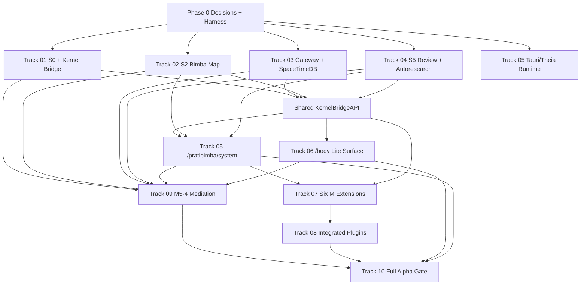

# M'/S' Implementation Tracks - Overview And Sequencing

This folder is the implementation-track plan for building the full M' system with S/S' integration baked in from the beginning. The work is not "build the M' UI, then connect the backend." Per [[m5-prime-system-shape-and-tauri-ide-canon]] section 1.2, M5-2 is the full S/S' stack, M5-3 is the full Tauri/Theia M' app, and M5-4 is the agentic mediation layer that binds them across the coordinate system. Those three attributions govern every track below.

## Goal

Turn the settled M'/S' canon into an engineering build program:

- Wire the M5-2 substrate first: S0 kernel/profile bridge, S2 bimba-map graph, S3 gateway/SpaceTimeDB stream, and S5 autoresearch/review state.
- Build M5-3 as one Tauri app with two surfaces: `/body` as the lightweight 0/1 daily surface and `/pratibimba/system` as the Theia-based deep IDE.
- Build M5-4 as governed Sophia/Anima/Pi/Aletheia mediation over real S0/S2/S3/S5 capabilities, not ad hoc agent power.
- Sequence six individual M extensions and two integrated plugins after the bridge and graph/review contracts are real enough to consume.
- Keep open architectural decisions explicit, prototype-gated, and user-final where needed.

## Source Specs

- [[M'-SYSTEM-SPEC]] - `Idea/Bimba/Seeds/M/M'-SYSTEM-SPEC.md`
- [[M'-PORTAL-SPEC]] - `Idea/Bimba/Seeds/M/M'-PORTAL-SPEC.md`
- [[M'-TAURI-PORT-SPEC]] - `Idea/Bimba/Seeds/M/M'-TAURI-PORT-SPEC.md`
- [[M0'-SPEC]] through [[M5'-SPEC]] - `Idea/Bimba/Seeds/M/M0'/M0'-SPEC.md` through `Idea/Bimba/Seeds/M/M5'/M5'-SPEC.md`
- [[m5-prime-system-shape-and-tauri-ide-canon]] - `Idea/Bimba/Seeds/M/M5'/m5-prime-system-shape-and-tauri-ide-canon.md`, especially sections 1.2, 3, 4, 5, 8, and 9
- [[2026-05-31-theia-ide-shell-and-m-plugin-architecture]] - `docs/plans/2026-05-31-theia-ide-shell-and-m-plugin-architecture.md`
- [[alpha_quaternionic_integration_across_M_stack]] - `Idea/Bimba/Seeds/M/alpha_quaternionic_integration_across_M_stack.md`, especially section 11
- [[m5-prime-autoresearch-self-improvement-loop]] and the six `epii-operational-capacities` specs under `Idea/Bimba/Seeds/M/M5'/`
- [[S0-S0i-CLI-CORE]], [[S2-S2i-GRAPH]], [[S3-S3i-GATEWAY]], and [[S5-S5i-SYNC]] under `docs/specs/S/`
- [[2026-05-22-vak-as-operational-substrate]] - `docs/superpowers/plans/2026-05-22-vak-as-operational-substrate.md` (all 10 chips closed; three-way parity `capability-matrix.json` ↔ runtime ↔ `anima.md` test-locked by `test_agent_capability_gates_anima_tools_matches_anima_md_tools`). This is the upstream-completed work that Tracks 01 / 04 / 09 extend rather than restart. See `IOD-17` in Track 11 for governance authority.
- The implementation surfaces under `Body/S/S0`, `Body/S/S2`, `Body/S/S3`, `Body/S/S5`, and `Body/M/epi-tauri`. The canonical agent-tool governance artifact is `Body/S/S4/plugins/pleroma/capability-matrix.json` with mirror views at `Body/S/S4/pi-agent/agents/anima.md` frontmatter and runtime `animaDefaultTools`; `Body/S/S4/ta-onta/S4-4p-anima/CONTRACT.md` is historical context (8-tool inventory, stale relative to the test-locked 15-tool parity) — not authority.

## Track Inventory

| Track | Primary attribution | What it delivers | Earliest downstream consumers |
| --- | --- | --- | --- |
| [[01-kernel-bridge-and-s0-foundation]] | M5-2 | S0/S0' profile, pointer, codon, readiness, schema, bridge, and capability foundation | `/body`, Theia, M extensions, M5-4 |
| [[02-s2-bimba-map-population]] | M5-2 | Neo4j/bimba-map schema convergence, population, n10s/GDS readiness, coordinate-native graph APIs | M0/M5 graph views, 4/5/0, evidence |
| [[03-s3-gateway-and-spacetimedb]] | M5-2 | Gateway RPC/event parity, native SpaceTimeDB subscriptions, shared-cosmos/session stream | Kernel bridge, `/body`, Theia, agents |
| [[04-s5-autoresearch-and-review-extension]] | M5-2 | Typed S5 candidates, routes, review gates, continuity, dry-run promotion, frontend-safe DTOs | Agentic Control Room, M5 extension, plugins |
| [[05-tauri-ide-shell-and-pratibimba-system]] | M5-3 | One Tauri app with `/body` plus Theia `/pratibimba/system`, M0/M5 IDE chrome, bridge adapter | Tracks 07-09 |
| [[06-zero-one-surface-evolution]] | M5-3 | Existing `/body` shell evolves into lite bridge consumer with review alerts and IDE intents | Daily flow, deep links, 4/5/0 |
| [[07-m-extension-individual-tracks]] | M5-3 | Six individual Theia M extensions, each consuming bridge/S-stack contracts | Integrated plugins, evidence, control room |
| [[08-integrated-plugin-tracks]] | M5-3 | Integrated 1-2-3 cosmic-engine plugin and 4/5/0 user-experience plugin | Review/evidence, agentic mediation |
| [[09-agentic-mediation-and-operational-capacities]] | M5-4 | VAK routing, Anima orchestration, bounded agent runs, six operational-capacity workflows | `/body`, Theia Control Room, S5 review |
| [[10-cross-cutting-integration-and-milestones]] | Cross-cutting | Integration ladder, demos, alpha gate, and dependency proof points | All tracks |
| [[11-open-architectural-decisions]] | Cross-cutting | Decision register for prototype, implementation-owner, user-final, dependency, and canon-drift questions | All tracks |

## Architectural Keystones

- **M5-2 Is Not Optional Plumbing:** S0, S2, S3, and S5 are the runtime substrate. They must land before or alongside the M' surfaces that depend on them.
- **One Kernel Bridge, Many Consumers:** `/body`, Theia, M extensions, integrated plugins, and agents consume the same `KernelBridgeAPI`, profile generation, readiness taxonomy, and S3 stream identity.
- **One Tauri App, Two Surfaces:** `/body` remains the first-load daily 0/1 surface; `/pratibimba/system` becomes the lazy-loaded deep Theia IDE in the same app.
- **S2 Owns Graph Law:** Graph viewers, coordinate trees, GDS overlays, and graph evidence consume S2 APIs and must not reconstruct coordinate law locally.
- **S5 Owns Governance State:** Review, autoresearch, routing, gates, evidence, dry-run promotion, and continuity are persisted S5 state; UI counts and agent claims must come from real DTOs.
- **M5-4 Is Governed Mediation:** Agents route through VAK/Anima and bounded capabilities. Human-required, deployment, recursive, privacy, and user-final gates are not bypassable.
- **Privacy Is A Release Gate:** Protected Nara/Graphiti bodies, raw identity data, private profile internals, and protected personal fields remain local/protected unless governed capabilities explicitly open safe handles.
- **Real Functionality Tests Only:** Mock-only tests, fake review counts, placeholder panels, and handcrafted happy-path backend payloads do not satisfy readiness.

## Tranches

### Phase 0 - Decision And Harness Gate

Immediate purpose: stop the big unknowns from becoming accidental architecture.

- Resolve or prototype the Track 11 blockers that shape build topology: `PRD-01` Theia runtime, `PRD-02` single vs multi-webview, `PRD-03` bridge host boundary, `IOD-01` S3 WebSocket surface, `IOD-04` profile versioning, `IOD-05` S2 root mapping, and `IOD-09` S5 storage/review metadata.
- Establish the live local-service harness required by Track 10 T0: gateway, SpaceTimeDB, Neo4j/Redis where needed, S5 persisted stores, Tauri app, Theia runtime, vault fixture area, and reset policy.
- Freeze the shared identifiers carried by every demo: profile generation, selected coordinate, session key, DAY/NOW, privacy class, S2 anchor, S3 deposition/session handle, S5 review/evidence id, and bridge readiness.

Exit criteria:

- ADRs exist for all prototype-gated decisions, including fallback policy.
- Local harness start/readiness behavior is explicit.
- No downstream track claims live readiness without naming its S0/S2/S3/S5 upstream state.

### Phase 1 - Substrate-First Vertical Slice

Immediate engineering tranches:

- Track 01 T0-T6: baseline S0 contract inventory, C/Rust profile hardening, S0' CLI/schema/gateway profile surface, SpaceTimeDB projection, shared TypeScript bridge contract, and bridge runtime MVP.
- Track 03 T1-T5: gateway WebSocket/RPC parity, native SpaceTimeDB subscription, shared-cosmos reducers/tables, and first `/body`/Theia bridge consumption slice.
- Track 02 T0-T5: graph schema convergence, relation-type reconciliation, seed/dataset population, `#` mapping resolution, and baseline coordinate-native graph payloads.
- Track 04 T0-T7: S5 schema extension, routing queues, orchestration state, review governance, dry-run promotion surface, agent-access snapshot, and M5-3 DTOs.
- Track 05 T0-T3 and Track 06 T0-T2: Theia/Tauri runtime proof, bridge adapter, and `/body` lite consumer.

Primary demo:

- S0 computes one profile generation -> S3 publishes it through native live stream -> kernel bridge consumes it -> `/body` lite client and Theia test extension observe the same generation -> M5-4 capability reader deposits governed evidence to S5.

Exit criteria:

- No duplicate frontend subscriptions for the same live state.
- Same profile generation and privacy class visible in CLI/gateway, bridge, `/body`, Theia, and S5 evidence.
- Missing S2/GDS/S5/M4 work appears as typed readiness blockers, not fake data.

### Phase 2 - Surface Assembly And Workbench MVP

Immediate engineering tranches:

- Track 05 T4-T9: Theia M0/M5 IDE chrome, cross-surface lifecycle, extension registry, integrated plugin host path, Agentic Control Room E2E, and one-app acceptance.
- Track 06 T3-T8: `/body` Shell 0/1 evolution, Nara/protected handles, review alerts, deep links, menubar/background lifecycle, and daily-surface acceptance.
- Track 02 T6-T9: n10s/OWL bridge, GDS overlays, API parity, consumption contracts, and runbooks.
- Track 04 T8-T9: non-Aletheia adapters and full S5 spine acceptance.
- Track 09 T0-T4: mediation contract, VAK routing, agent authority registry, evidence bridge, and operational capacity registry.

Primary demo:

- `/body` opens with real bridge state, review/readiness alerts, and safe Shell 0/1 data; the user summons Theia; Theia opens a live S2 graph node, a live S5 review/autoresearch record, and the Agentic Control Room over the same profile/session context.

Exit criteria:

- The Tauri app can move between `/body` and `/pratibimba/system` without losing session, profile generation, review notification, or selected coordinate.
- M0/M5 IDE chrome consumes real S2/S5 payloads.
- Agentic Control Room displays route/evidence/review state from persisted S5 records and gateway events.

### Phase 3 - Extensions, Integrated Plugins, And Operational Capacities

Immediate engineering tranches:

- Track 07 T0-T10: shared extension contracts and first real contributions for `m0-anuttara`, `m1-paramasiva`, `m2-parashakti`, `m3-mahamaya`, `m4-nara`, and `m5-epii`.
- Track 08 T0-T9: integrated plugin composition contracts, 1-2-3 cosmic engine, 4/5/0 protected recognition surface, evidence hooks, deep links, performance/accessibility/privacy gates.
- Track 09 T5-T10: Anuttara/Parashakti deterministic capacity slices, Paramasiva/Mahamaya training-runtime slices, Nara Anima-primary voice governance, Epii-on-Epii recursive governance, `/body` and Theia mediation surfaces, and full M5-4 release gate.
- Track 10 T6-T9: six-extension acceptance, integrated plugin acceptance, M5-4 E2E, full alpha gate and replan.

Primary demo:

- Six M extensions activate in Theia; 1-2-3 updates M1/M2/M3 from one profile generation; 4/5/0 renders protected handles plus canonical graph backdrop without leaking raw bodies; a mediated M5-4 run deposits evidence and lands in governed S5 review.

Exit criteria:

- All six subsystem tracks have first real bridge-backed contributions.
- Both integrated plugins compose individual extension contracts rather than duplicating backend or extension logic.
- All six operational capacities have at least one real mediated readiness path into S5 review/autoresearch.

## Dependencies

Critical dependency edges:

- Track 03 native stream plus Track 01 bridge contract precede any live `/body`, Theia, extension, plugin, or agent claim.
- Track 02 graph API parity precedes graph viewer, coordinate tree, M0/M5 evidence, 4/5/0 backdrop, and graph-backed agent context.
- Track 04 typed S5 state precedes Agentic Control Room, M5 extension, integrated-plugin evidence hooks, and operational M5-4 authority.
- Track 05 runtime decisions precede Track 07/08 package skeletons, deep links, workspace persistence, and one-app acceptance.
- Track 09 can start contract and registry work early, but operational agent runs wait for S5 governance and bridge capabilities.

## Immediate Actionable Work

The first implementation sprint should avoid pretty surfaces and attack the seams:

- Prototype Theia-in-Tauri, single/multi-webview behavior, and bridge hosting; record ADRs before extension APIs freeze.
- Finish the S0 profile/bridge contract enough for a real `MathemeHarmonicProfile` generation to travel through CLI/gateway/schema/TS validation.
- Complete the S3 native SpaceTimeDB WebSocket milestone and prove reconnect/resync semantics.
- Reconcile S2 schema/seed relation gaps, `#` root mapping, and baseline coordinate-native graph payloads.
- Extend S5 typed candidate/review/evidence DTOs so Theia and agents have real state to display and deposit into.
- Build the first shared bridge subscriber that can feed both `/body` lite mode and a Theia test extension from one source.

## Open Decisions

Use [[11-open-architectural-decisions]] as the live decision ledger. The highest-leverage decisions to settle first are:

- `PRD-03` kernel-bridge host boundary.
- `PRD-01` Theia browser-mode/Tauri hosting fallback.
- `IOD-01` single client-facing S3 WebSocket surface.
- `IOD-02` SpaceTimeDB auth/RLS and privacy discipline.
- `IOD-04` profile versioning and `binary`/`mahamaya` compatibility.
- `IOD-05` S2 canonical `#` root mapping.
- `IOD-09` S5 state storage and `ReviewSource` metadata.
- `UFV-01` privacy and consent copy.
- `UFV-02` user-final validation thresholds for recursive or corpus-affecting changes.

Deferred canon-drift questions such as M0/M1 `+1`, M3 `16+1`, M2 planet-count semantics, M4 identity-quaternion naming, and audio/cymatic ownership should remain visible readiness notes until user-final validation or source updates resolve them.

## Success Criteria

- An engineer can pick up any track file and begin work against ordered tranches, dependencies, open decisions, and verification gates.
- The master sequence makes cross-track blocking relationships legible, especially S0/S2/S3/S5 before dependent M5-3 surfaces.
- The plan folder covers kernel substrate, bimba-map population, gateway/SpaceTimeDB, S5 cores, Theia shell, `/body`, six M extensions, two integrated plugins, agentic mediation, integration milestones, and open decisions.
- Every M5-3 surface consumes S/S' substrate through shared contracts and never relies on fake local law for tick, graph, codon, correspondence, review, or protected-personal state.
- Every M5-4 workflow routes through VAK/Anima, bounded capabilities, persisted S5 evidence/review, and explicit human/privacy gates.
- All release gates require real local services or captured-live fixtures generated by those services; mock-only and placeholder implementation paths are not accepted.
- Open decisions are surfaced with validation paths and consequences, not silently resolved inside individual tracks.
